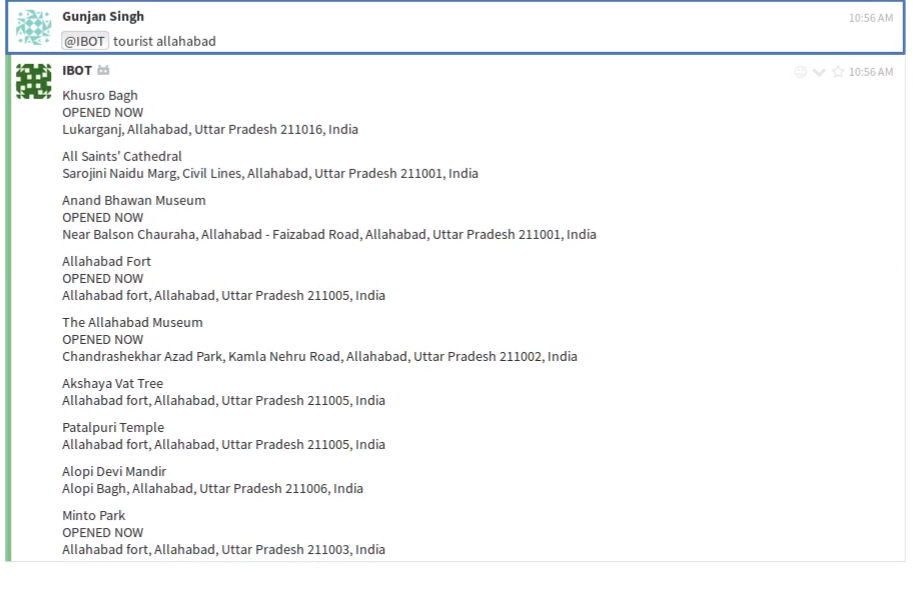
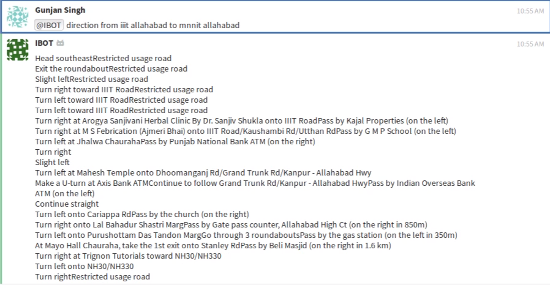

# Welcome to I-BOT

## Introduction
I-BOT is an intelligent chatbot build using python on ZulipChat that helps you during relocation to a different city or even a country. Have any problems, just open I-BOT and chat with your interactive buddy! 

## Features

1. Currency Convertor 
2. Near by ATM's locator 
3. Language Translator 
4. Nearby Restaurants locator 
5. Gides you direction to different places 
6. Gives nearest bus transportation service 
7. Helps you in finding your desired job in a particular location 
8. Tourist Spots in the city 
9. NLP Based instant response


## Instructions to run locally:
1. [Create a Zulip Realm](https://zulip.com/create_realm/)
2. Goto to settings and create a new generic bot named 'ibot'. (Settings can be found in dropdown of gear icon present in top right corner of zulip realm)
3. Download the zuliprc file for your bot and place it in your home directory as '.zuliprc'.
4. Install all the requirements using ``` pip3 install -r requirements.txt ```
5. In ``` bot.py ``` , change site in ``` self.client = zulip.Client(site="https://rhtp.zulipchat.com/api/") ``` to url of your created zulip realm.Do the same for ``` BOT_MAIL ``` variable.  
6. Run ``` bot.py ``` using python 3. ``` python3 bot.py ```
7. Head over to your created zulip realm and start using the bot.
 

## How to use?

### Nearby ATMs
To get addresses of nearby ATM(s)  
`ibot atm "nearby location"`


### Nearby Restaurants
To get addresses of nearby Restaurant(s)  
`ibot restaurant "nearby location"`


### Nearby Bus Stands
To get addresses of nearby bus stand(s)  
`ibot bus "nearby location"`


### Nearby Tourist Places
To get addresses of nearby tourist place(s)  
`ibot tourist "nearby location"`


### Language Translation
To translate your English sentences to other languages.  
`ibot language to "language name"`


### Jobs Nearby
To get a list of jobs available nearby.  
`ibot job "nearby location"`


### Directions
To get directions from one place to another.  
`ibot direction from "source" to "destination"`


### Currency Convertor
To get currency conversion rate.  
`ibot currency from "currency code - 1" to "currency code - 2"`


## Contributors
* [Gunjan Singh](https://github.com/gunjansingh97)  
* [Naguboyina Sravya](https://github.com/sravya31)  
* [Prankur Agarwal](https://github.com/prankuragarwal)  
* [Vrinda Agarwal](https://github.com/avrinda97)    

## Contribute

Feel free to report issues and bugs.It will be helpful for future launches of application.   
All suggestions are welcome.   
Fork repository and contribute.  

## Acknowledgements
Thanks to Zulip for providing Zulip API and Platform.
